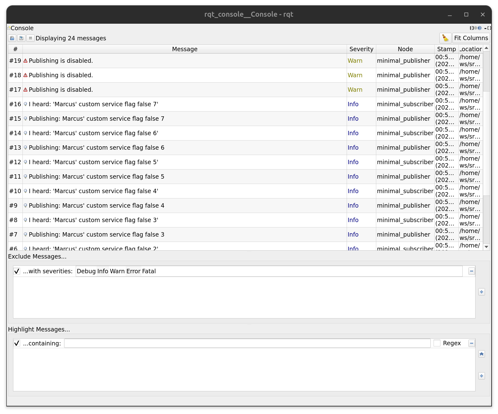

# my_beginner_tutorials

## Overview
This pacakage contains the beginner tutorials for ROS 2 Humble assigned in the ROS 2 Programming Assignment 3 - tf2, unit testing, bag files assignment in ENPM 700 RO01 Fall 2025.

## Contributors
Marcus Hurt

## Dependencies
- ROS2 Humble

## Build/Run Steps
Remember to source ROS and the overlay in any new terminals.

```bash
# Source the ROS 2 underlay
source /opt/ros/humble/setup.bash

# Make a colcon workspace for ROS 2 and enter the src/ directory
mkdir -p ros_ws/src
cd ros_ws/src

# Clone the package into the src/ directory
git clone https://github.com/mdevhurt1/my_beginner_tutorials.git

# Navigate to the workspace root and build with colcon
cd ..
colcon build --packages-select beginner_tutorials

# Source the overlay
source install/local_setup.bash

# Run the talker node
ros2 run beginner_tutorials talker_node

# Run the listener node
ros2 run beginner_tutorials listener_node

# Run the talker and listener from the launch file
ros2 launch beginner_tutorials tutorial.launch.py

# Run the talker and listener with cmd line modifications
ros2 launch beginner_tutorials tutorial.launch.py publishing_flag:=false

# Call the talker set_flag service
ros2 service call /set_flag std_srvs/srv/SetBool {'data: true'}

# Run the bag recorder to record all topics
ros2 launch beginner_tutorials bag.launch.py record_bag:=true

# Run the bag recorder to record all topics, but disable to bag recording
ros2 launch beginner_tutorials bag.launch.py record_bag:=false

# Inspect the bag file (assuming you are in the root of your colcon workspace)
ros2 bag info src/my_beginner_tutorials/results/rosbag2_2025_11_17-00_07_48/rosbag2_2025_11_17-00_07_48_0.db3

# Replay the bag file, run the listener_node as shown above in another terminal (assuming you are in the root of your colcon workspace)
ros2 bag play src/my_beginner_tutorials/results/rosbag2_2025_11_17-00_07_48/rosbag2_2025_11_17-00_07_48_0.db3

# Inspect TF frames
ros2 run tf2_ros tf2_echo world talk
ros2 run tf2_tools view_frames

# Run tests
colcon test --packages-select beginner_tutorials
```

## Deliverables
### rqt_console screenshot


### frames pdf


### bag file
Look insde results for the rosbag2 directory.